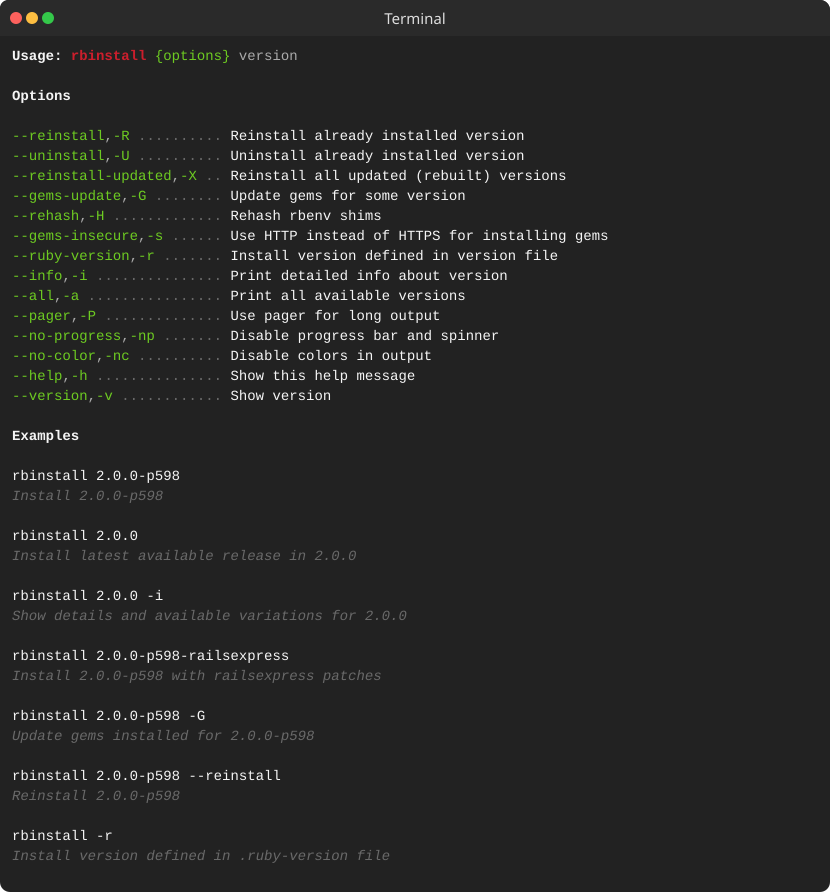
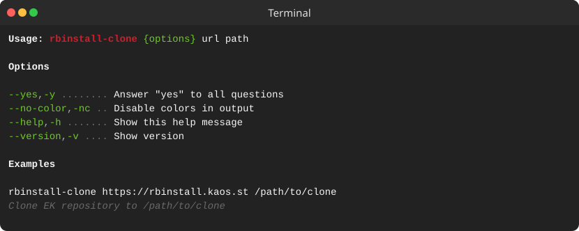
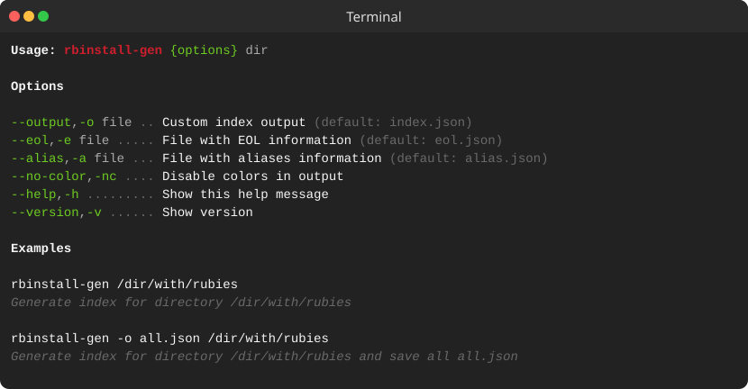

> [!IMPORTANT]
> ### Project Sunset Notice 🌇
>
> ***This project is no longer actively maintained.***
>
> After careful consideration, we’ve decided to sunset development and support for this repository. While it has been a valuable effort, we are no longer able to dedicate the time and resources required to maintain it at the level we consider responsible.
> <details>
> <summary><b>More info</b></summary>
>
> #### Availability timeline
>
> The repository and all existing Ruby builds will remain **accessible and functional until September 1, 2026**. After this date, access to the repository and its artifacts may be disabled or the repository may be removed without additional notice.
>
> #### What this means
>
> - No new features or enhancements will be added;
> - Bug fixes and security updates are not guaranteed;
> - Issues and pull requests may not receive responses;
> - No new Ruby versions or rebuilds will be published;
> - Existing builds will not receive updates, including security fixes;
> - Automation, CI/CD pipelines, or systems that depend on this repository should be migrated before the sunset date.
>
> #### For existing users
>
> The code will remain available in its current state for reference and continued use under the existing license. However, you should consider migrating to alternative solutions or forking the project if you plan to rely on it long-term.
>
> If you rely on binaries from public repository:
>
> - Mirror repository in your own infrastructure using `rbinstall-clone`;
> - Update your configuration to use an alternative source;
> - Plan and complete migration **before September 1, 2026** to avoid disruptions.
>
> #### Forking and continuation
>
> If you are interested in taking over maintenance or building upon this project, you are encouraged to fork it.
>
> #### Thank you
>
> We sincerely appreciate everyone who contributed, reported issues, or used this project. Your support made it worthwhile.
> </details>

----

<p align="center"><a href="#readme"></a></p>

<p align="center">
  <a href="https://kaos.sh/r/rbinstall"></a>
  <a href="https://kaos.sh/y/ek"></a>
  <a href="https://kaos.sh/w/rbinstall/ci"></a>
  <a href="https://kaos.sh/w/rbinstall/codeql"></a>
  <a href="#license"></a>
</p>

<p align="center">
  <a href="#usage-demo">Usage demo</a> • <a href="#installation">Installation</a> • <a href="#usage">Usage</a> • <a href="#ci-status">CI Status</a> • <a href="#contributing">Contributing</a> • <a href="#license">License</a>
</p>

`rbinstall` is a utility for installing prebuilt Ruby to [rbenv](https://github.com/rbenv/rbenv).

> [!NOTE]
> Take a look at our [FAQ](https://kaos.sh/rbinstall/w/FAQ) for more information.

### Usage demo

[](#usage-demo)

### Installation

#### From [ESSENTIAL KAOS Public Repository](https://kaos.sh/kaos-repo)

```bash
sudo dnf install -y https://pkgs.kaos.st/kaos-repo-latest.el$(grep 'CPE_NAME' /etc/os-release | tr -d '"' | cut -d':' -f5).noarch.rpm
sudo dnf install rbinstall
```

### Usage

#### `rbinstall`

<p align="center"></p>

#### `rbinstall-clone`

<p align="center"></p>

#### `rbinstall-gen`

<p align="center"></p>

### CI Status

| Branch | Status |
|--------|--------|
| `master` | [](https://kaos.sh/w/rbinstall/ci-push?query=branch:master) |
| `develop` | [](https://kaos.sh/w/rbinstall/ci-push?query=branch:develop) |

### Contributing

Before contributing to this project please read our [Contributing Guidelines](https://github.com/essentialkaos/.github/blob/master/CONTRIBUTING.md).

### License

[Apache License, Version 2.0](https://www.apache.org/licenses/LICENSE-2.0)

<p align="center"><a href="https://kaos.dev"></a></p>
